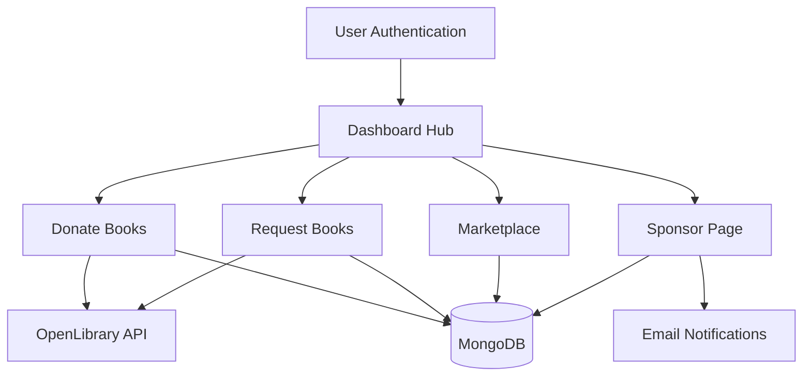

# 📚 BookBridge - Online Book Sharing & Exchange Platform

[](https://reactjs.org/)
[](https://nodejs.org/)
[](https://www.mongodb.com/)
[](https://expressjs.com/)
[](LICENSE)

**BookBridge** is a comprehensive online platform that connects book lovers, students, and donors through book sharing, donation, and exchange services. Built with modern web technologies, it provides an intuitive way to donate books, request needed books, browse marketplace offerings, and sponsor student requests.

## 🌟 Features

### 📖 Core Functionality
- **Book Donation System**: Donate books with auto-filled details via OpenLibrary API
- **Book Request System**: Request books with intelligent search and auto-suggestions
- **Marketplace**: Browse and purchase second-hand books (FREE and PAID)
- **Sponsorship System**: Approve/reject student book requests with contact sharing
- **Dashboard Analytics**: Comprehensive tracking of all activities and request status

### 🚀 Enhanced Features
- **Real-time Book Search**: Auto-suggestions while typing book titles
- **ISBN Auto-fill**: Automatic book details population from ISBN
- **Contact Management**: Protected contact details until approval
- **Email Notifications**: Status updates for all request changes
- **Image Upload**: Book cover images with preview functionality
- **Address Management**: Complete delivery address collection
- **Urgency Levels**: Priority-based request categorization

### 🎨 User Experience
- **Modern UI**: Clean, responsive design with Tailwind CSS
- **Loading States**: Professional loading indicators and feedback
- **Error Handling**: Comprehensive error messages and validation
- **Mobile Responsive**: Works seamlessly on all devices
- **Intuitive Navigation**: Easy-to-use interface for all user types

## 🛠️ Technology Stack

### Frontend
- **React.js** - Modern UI library with hooks
- **Tailwind CSS** - Utility-first CSS framework
- **React Router** - Client-side routing
- **Axios** - HTTP client for API communication
- **Lucide React** - Beautiful icon library

### Backend
- **Node.js** - JavaScript runtime environment
- **Express.js** - Web application framework
- **MongoDB** - NoSQL database
- **Mongoose** - MongoDB object modeling
- **JWT** - JSON Web Tokens for authentication
- **Multer** - File upload middleware

### External APIs
- **OpenLibrary API** - Book metadata and cover images
- **Email Service** - Notification system

## 📋 Prerequisites

Before running this project, make sure you have the following installed:

- **Node.js** (v18.0 or higher)
- **npm** (v8.0 or higher)
- **MongoDB** (v6.0 or higher)
- **Git** (for cloning the repository)

## 🚀 Installation & Setup

### 1. Clone the Repository
```bash
git clone https://github.com/PrinceGhevariya-23DCS033/BookBridge-Online-Book-Sharing-Exchange-Platform.git
cd BookBridge-Online-Book-Sharing-Exchange-Platform
```

### 2. Install Dependencies

#### Frontend Setup
```bash
cd project
npm install
```

#### Backend Setup
```bash
cd project/backend
npm install
```

### 3. Environment Configuration

Create `.env` file in the `project/backend` directory:
```env
PORT=5000
MONGODB_URI=mongodb://localhost:27017/bookbridge
JWT_SECRET=your_jwt_secret_key_here
EMAIL_SERVICE=your_email_service
EMAIL_USER=your_email@example.com
EMAIL_PASS=your_email_password
```

### 4. Database Setup

Make sure MongoDB is running on your system:
```bash
# Windows
net start MongoDB

# macOS/Linux
sudo systemctl start mongod
```

### 5. Start the Application

#### Start Backend Server
```bash
cd project/backend
npm start
```
The backend server will run on `http://localhost:5000`

#### Start Frontend Development Server
```bash
cd project
npm run dev
```
The frontend will run on `http://localhost:5173`

## 📱 Usage Guide

### For Students (Book Requesters)
1. **Register/Login** to your account
2. **Request Books**: Search by title or ISBN, auto-fill details
3. **Add Delivery Address**: Complete address for book delivery
4. **Track Requests**: Monitor status in dashboard
5. **Contact Sponsors**: Get contact details for approved requests

### For Donors
1. **Register/Login** to your account
2. **Donate Books**: Search and auto-fill book details
3. **Upload Images**: Add book cover images
4. **Provide Contact**: Add your contact information
5. **Track Donations**: See your donation impact

### For Sponsors
1. **Register/Login** to your account
2. **Review Requests**: Browse pending student requests
3. **Approve/Reject**: Make sponsorship decisions
4. **Share Contacts**: Automatic contact sharing on approval
5. **Track Impact**: Monitor sponsored books

## 🗄️ Database Schema

### Collections
- **Users**: User profiles and authentication
- **Books**: Book metadata and marketplace items
- **Donations**: Donated book records
- **Requests**: Student book requests
- **Sponsorships**: Approval/rejection records
- **Orders**: Purchase transactions

## 🔧 API Endpoints

### Authentication
- `POST /api/auth/register` - User registration
- `POST /api/auth/login` - User login
- `GET /api/auth/profile` - Get user profile

### Books
- `GET /api/books` - Get all books
- `POST /api/books` - Add new book
- `GET /api/books/:id` - Get book details

### Requests
- `GET /api/requests` - Get all requests
- `POST /api/requests` - Create new request
- `PUT /api/requests/:id` - Update request status
- `GET /api/requests/dashboard` - Dashboard analytics

### Donations
- `GET /api/donations` - Get all donations
- `POST /api/donations` - Create new donation

## 🎯 System Architecture



## 🤝 Contributing

We welcome contributions! Please follow these steps:

1. **Fork** the repository
2. **Create** a feature branch (`git checkout -b feature/AmazingFeature`)
3. **Commit** your changes (`git commit -m 'Add some AmazingFeature'`)
4. **Push** to the branch (`git push origin feature/AmazingFeature`)
5. **Open** a Pull Request

### Development Guidelines
- Follow existing code style and conventions
- Write clear commit messages
- Add comments for complex logic
- Test your changes thoroughly
- Update documentation as needed

## 📝 License

This project is licensed under the MIT License - see the [LICENSE](LICENSE) file for details.

## 👥 Team

- **Prince Ghevariya** - *Lead Developer* - [@PrinceGhevariya-23DCS033](https://github.com/PrinceGhevariya-23DCS033)

## 🆘 Support

If you encounter any issues or have questions:

1. **Check** the [Issues](https://github.com/PrinceGhevariya-23DCS033/BookBridge-Online-Book-Sharing-Exchange-Platform/issues) section
2. **Create** a new issue if your problem isn't already reported
3. **Provide** detailed information about the issue
4. **Include** steps to reproduce the problem

## 🙏 Acknowledgments

- **OpenLibrary API** for providing comprehensive book metadata
- **React Community** for excellent documentation and resources
- **MongoDB** for robust database solutions
- **Tailwind CSS** for beautiful styling utilities
- **All Contributors** who help improve this project

## 🔮 Future Enhancements

- [ ] Real-time chat system between users
- [ ] Book recommendation engine
- [ ] Mobile application (React Native)
- [ ] Advanced search filters
- [ ] Book rating and review system
- [ ] Social features and user profiles
- [ ] Integration with more book APIs
- [ ] Multi-language support
- [ ] Advanced analytics dashboard
- [ ] Automated matching system

---

**Made with ❤️ for the book-loving community**

*BookBridge - Connecting readers, sharing knowledge, building communities*# BookBridge

