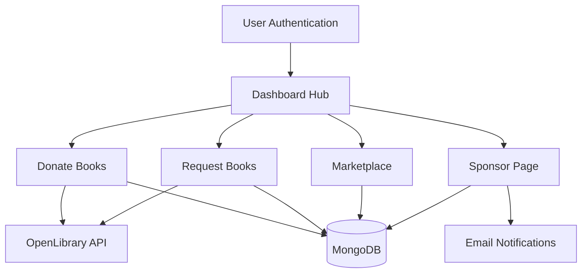

# 📚 BookBridge - Online Book Sharing & Exchange Platform

[](https://reactjs.org/)
[](https://nodejs.org/)
[](https://www.mongodb.com/)
[](https://expressjs.com/)
[](LICENSE)

**BookBridge** is a comprehensive online platform that connects book lovers, students, and donors through book sharing, donation, and exchange services. Built with modern web technologies, it provides an intuitive way to donate books, request needed books, browse marketplace offerings, and sponsor student requests.

---

## 🌟 Features

### 📖 Core Functionality

* **Book Donation System**: Donate books with auto-filled details via OpenLibrary API
* **Book Request System**: Request books with intelligent search and auto-suggestions
* **Marketplace**: Browse and purchase second-hand books (FREE and PAID)
* **Sponsorship System**: Approve/reject student book requests with contact sharing
* **Dashboard Analytics**: Comprehensive tracking of all activities and request status

### 🚀 Enhanced Features

* **Real-time Book Search**: Auto-suggestions while typing book titles
* **ISBN Auto-fill**: Automatic book details population from ISBN
* **Contact Management**: Protected contact details until approval
* **Email Notifications**: Status updates for all request changes
* **Image Upload**: Book cover images with preview functionality
* **Address Management**: Complete delivery address collection
* **Urgency Levels**: Priority-based request categorization

### 🎨 User Experience

* **Modern UI**: Clean, responsive design with Tailwind CSS
* **Loading States**: Professional loading indicators and feedback
* **Error Handling**: Comprehensive error messages and validation
* **Mobile Responsive**: Works seamlessly on all devices
* **Intuitive Navigation**: Easy-to-use interface for all user types

---

## 🛠️ Technology Stack

### Frontend

* **React.js**
* **Tailwind CSS**
* **React Router**
* **Axios**
* **Lucide React**

### Backend

* **Node.js**
* **Express.js**
* **MongoDB**
* **Mongoose**
* **JWT**
* **Multer**

### External APIs

* **OpenLibrary API**
* **Email Service**

---

## 📋 Prerequisites

Before running this project, make sure you have installed:

* **Node.js** (v18.0 or higher)
* **npm** (v8.0 or higher)
* **MongoDB** (v6.0 or higher)
* **Git**

---

## 🚀 Installation & Setup

### 1. Clone the Repository

```bash
git clone https://github.com/Utsav280805/BookBridge.git
cd BookBridge
```

### 2. Install Dependencies

#### Frontend

```bash
cd project
npm install
```

#### Backend

```bash
cd project/backend
npm install
```

### 3. Environment Configuration

Create `.env` in `project/backend`:

```env
PORT=5000
MONGODB_URI=mongodb://localhost:27017/bookbridge
JWT_SECRET=your_jwt_secret_key_here
EMAIL_SERVICE=your_email_service
EMAIL_USER=your_email@example.com
EMAIL_PASS=your_email_password
```

### 4. Start Services

Make sure MongoDB is running:

```bash
# Windows
net start MongoDB

# macOS/Linux
sudo systemctl start mongod
```

### 5. Run Application

#### Backend

```bash
cd project/backend
npm start
```

Backend runs at `http://localhost:5000`

#### Frontend

```bash
cd project
npm run dev
```

Frontend runs at `http://localhost:5173`

---

## 📱 Usage Guide

### Students (Requesters)

1. Register/Login
2. Request Books (search by title/ISBN)
3. Add delivery address
4. Track requests via dashboard
5. Contact sponsors (after approval)

### Donors

1. Register/Login
2. Donate books (with auto-fill + images)
3. Add contact info
4. Track donations

### Sponsors

1. Register/Login
2. Review student requests
3. Approve/Reject
4. Share contacts automatically
5. Track sponsored books

---

## 🗄️ Database Schema

* **Users**
* **Books**
* **Donations**
* **Requests**
* **Sponsorships**
* **Orders**

---

## 🔧 API Endpoints

### Authentication

* `POST /api/auth/register`
* `POST /api/auth/login`
* `GET /api/auth/profile`

### Books

* `GET /api/books`
* `POST /api/books`
* `GET /api/books/:id`

### Requests

* `GET /api/requests`
* `POST /api/requests`
* `PUT /api/requests/:id`
* `GET /api/requests/dashboard`

### Donations

* `GET /api/donations`
* `POST /api/donations`

---

## 🎯 System Architecture



---

## 🤝 Contributing

1. Fork repo
2. Create feature branch (`git checkout -b feature/XYZ`)
3. Commit changes
4. Push branch
5. Open Pull Request

---

## 📝 License

This project is licensed under the MIT License - see [LICENSE](LICENSE).

---

## 👥 Team

* **Utsav** – *Lead Developer* – [@Utsav280805](https://github.com/Utsav280805)

---

## 🙏 Acknowledgments

* OpenLibrary API
* React Community
* MongoDB
* Tailwind CSS
* All Contributors

---

## 🔮 Future Enhancements

* [ ] Real-time chat
* [ ] Recommendation engine
* [ ] Mobile app (React Native)
* [ ] Advanced search filters
* [ ] Reviews & ratings
* [ ] Social features
* [ ] Multi-language support
* [ ] Analytics dashboard
* [ ] Auto-matching system

---

**Made with ❤️ for the book-loving community**
*BookBridge - Connecting readers, sharing knowledge, building communities*

